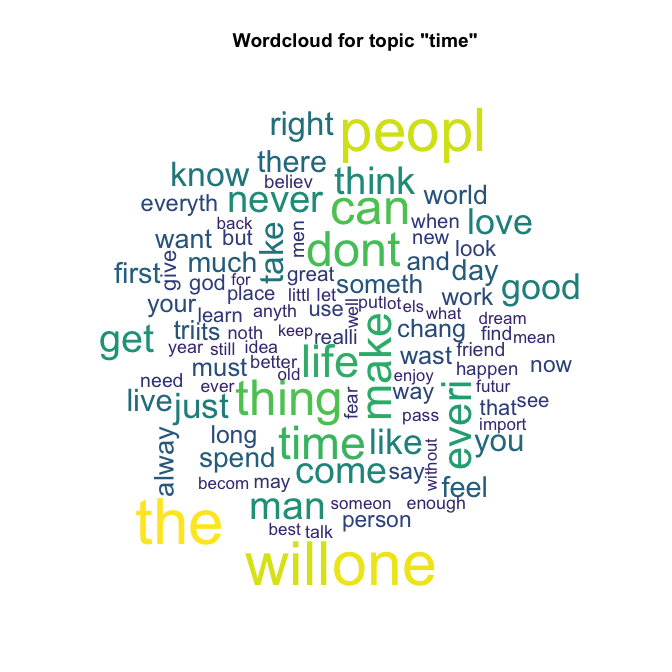
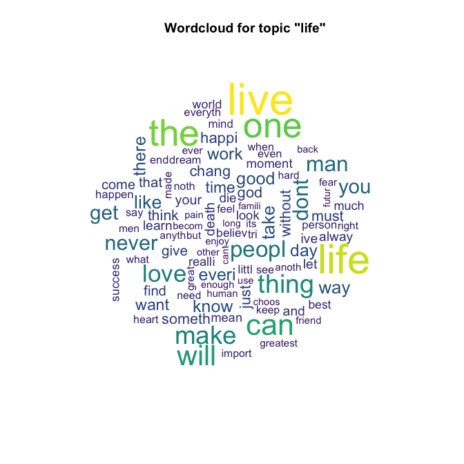

<!-- README.md is generated from README.Rmd. Please edit that file -->
quotes
======

[](https://travis-ci.org/egarpor/quotes) [](https://www.gnu.org/licenses/gpl-3.0)

Overview
--------

Random quotes directly from `R`! A collection of quotes for a variety of topics and from renowned personalities. Useful for illustrating text mining analyses.

Install
-------

``` r
# install.packages("devtools")
library(devtools)
install_github("egarpor/quotes")
```

Usage
-----

### Random quotes

``` r
# Load package
library(quotes)

# Dataset
str(quotes)
#> Classes 'data.table' and 'data.frame':   75966 obs. of  4 variables:
#>  $ id    : int  6768 7643 15837 38283 42874 47600 15700 4238 15797 62802 ...
#>  $ quote : Factor w/ 61071 levels "'10' was amazing! I had no career before '10' and then all of a sudden I was able to do pretty much whatever I was able to do i"| __truncated__,..: 11553 2587 53255 41310 27544 2587 38997 44055 705 705 ...
#>  $ author: Factor w/ 11174 levels "A. A. Milne",..: 1 1 1 1 1 1 2 3 3 3 ...
#>  $ topic : Factor w/ 117 levels "age","alone",..: 10 12 27 59 66 72 25 7 27 98 ...
#>  - attr(*, ".internal.selfref")=<externalptr> 
#>  - attr(*, "sorted")= chr  "author" "topic"
head(quotes)
#>       id
#> 1:  6768
#> 2:  7643
#> 3: 15837
#> 4: 38283
#> 5: 42874
#> 6: 47600
#>                                                                                                                         quote
#> 1:                                     Golf is so popular simply because it is the best game in the world at which to be bad.
#> 2:                         Almost anyone can be an author the business is to collect money and fame from this state of being.
#> 3:                                                                              To the uneducated, an A is just three sticks.
#> 4: Promise me you'll always remember: You're braver than you believe, and stronger than you seem, and smarter than you think.
#> 5:             If you live to be a hundred, I want to live to be a hundred minus one day so I never have to live without you.
#> 6:                         Almost anyone can be an author the business is to collect money and fame from this state of being.
#>         author        topic
#> 1: A. A. Milne         best
#> 2: A. A. Milne     business
#> 3: A. A. Milne    education
#> 4: A. A. Milne intelligence
#> 5: A. A. Milne         love
#> 6: A. A. Milne        money

# Random quotes
set.seed(654321)
rquotes(n = 1)
#>       id
#> 1: 74433
#>                                                                                       quote
#> 1: It is the working man who is the happy man. It is the idle man who is the miserable man.
#>               author topic
#> 1: Benjamin Franklin  work
rquotes(n = 1, top = "science")
#>       id
#> 1: 55390
#>                                                                                                                                                                               quote
#> 1: It's a good question, because a movie isn't good or bad based on its politics. It's usually good or bad for other reasons, though you might agree or disagree with its politics.
#>         author    topic
#> 1: Roger Ebert politics
rquotes(n = 1, auth = "Bertrand Russell")
#>     id
#> 1: 306
#>                                                                                       quote
#> 1: Old age is ready to undertake tasks that youth shirked because they would take too long.
#>                 author topic
#> 1: W. Somerset Maugham   age
```

### Wordcloud for topic-related quotes

``` r
# Load packages
library(quotes)
library(tm)
library(SnowballC)
library(wordcloud)
library(viridis)

for (top in c("time", "life", "knowledge")) {

  # Preprocessing
  corpus <- Corpus(VectorSource(quotes[topic == top]$quote))
  corpus <- tm_map(corpus, removePunctuation)
  corpus <- tm_map(corpus, stripWhitespace)
  corpus <- tm_map(corpus, removeNumbers)
  corpus <- tm_map(corpus, removeWords, c(stopwords("english"), top))
  corpus <- tm_map(corpus, stemDocument)
  
  # Wordcloud
  wordcloud(corpus, max.words = 100, col = viridis(100))
  title(paste("Wordcloud for topic \"", top, "\"", sep = ""))

}
```



Credits
-------

The data has been extracted from the *Famous Quotes Database* availiable on <http://thewebminer.com/download>.
